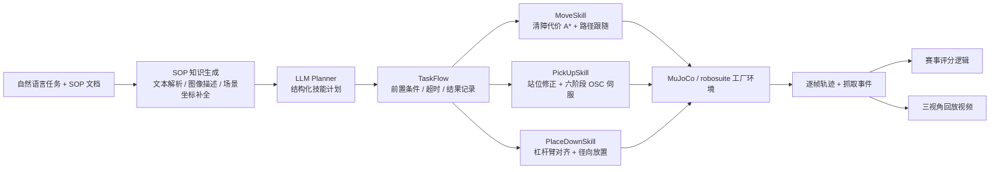

<div align="center">

# SOP-Runner

### JCIIOT 2026 工业具身智能挑战赛技术报告与可复现提交

**Tiago 双臂移动机器人 · 五场景满分 · 100/100 · 最终评分无碰撞扣分**

[English Technical Report](docs/TECHNICAL_REPORT_EN.md) · [完整设计记录](docs/DEVELOPMENT_LOG_ZH.md) · [精简代码包](code/) · [轨迹证据](trajectories/) · [视频中心](videos/)

</div>

> 结果边界：本页成绩来自仓库内保存的 2026-08-16 最终端到端运行，并由赛事仓库随附的评分逻辑生成；它们是可审计的自测结果，不冒充主办方最终认证成绩。所有数值均以提交的 `score_*.json` 为准。

## 一页摘要

SOP-Runner 面向五个 FactorySorting 工业搬运场景，将自然语言 SOP 转换为 `move → pick_up → move → place_down` 技能序列，并以清障代价 A*、可视外壳约束、双臂六阶段抓取伺服、拥挤桌面径向放置和多物体在线重选完成执行。最终五关均获得满分，总计 **100/100**；五份评分文件没有碰撞扣分，L5 的三个料箱均产生独立成功抓取事件并到达目标台面。

本方案的重点不是某个孤立模型，而是把规划、移动、抓取、放置和证据链做成一个闭环：LLM 只负责可解释的任务分解；几何与状态机负责可重复执行；每次运动同步写入轨迹；最终结果、评分 JSON 和三视角视频一一对应。

## 演示视频（点击图片直接播放）

GitHub README 不稳定支持内嵌 `<video>`，因此采用“真实视频帧预览 + 仓库内 MP4 链接”：点击下方任一预览即可进入 GitHub 原生播放器。整合版同时展示鸟瞰、机器人第一视角和跟随视角。

| L1 · 10/10 | L2 · 15/15 |
|:---:|:---:|
| [](videos/composed/L1_composed.mp4) | [](videos/composed/L2_composed.mp4) |
| [整合版 MP4](videos/composed/L1_composed.mp4) · [鸟瞰](videos/individual/L1_birdview.mp4) · [第一视角](videos/individual/L1_robotview.mp4) · [跟随](videos/individual/L1_follow.mp4) | [整合版 MP4](videos/composed/L2_composed.mp4) · [鸟瞰](videos/individual/L2_birdview.mp4) · [第一视角](videos/individual/L2_robotview.mp4) · [跟随](videos/individual/L2_follow.mp4) |

| L3 · 20/20 | L4 · 25/25 |
|:---:|:---:|
| [](videos/composed/L3_composed.mp4) | [](videos/composed/L4_composed.mp4) |
| [整合版 MP4](videos/composed/L3_composed.mp4) · [鸟瞰](videos/individual/L3_birdview.mp4) · [第一视角](videos/individual/L3_robotview.mp4) · [跟随](videos/individual/L3_follow.mp4) | [整合版 MP4](videos/composed/L4_composed.mp4) · [鸟瞰](videos/individual/L4_birdview.mp4) · [第一视角](videos/individual/L4_robotview.mp4) · [跟随](videos/individual/L4_follow.mp4) |

| L5 · 30/30 | 五关总览 |
|:---:|:---:|
| [](videos/composed/L5_composed.mp4) | [](videos/) |
| [整合版 MP4](videos/composed/L5_composed.mp4) · [鸟瞰](videos/individual/L5_birdview.mp4) · [第一视角](videos/individual/L5_robotview.mp4) · [跟随](videos/individual/L5_follow.mp4) | [全部 20 个视频与规格](videos/README.md) |

## 定量结果

| 关卡 | 场景与任务 | 成功离开 | 最终目标误差 | 运行耗时 | 得分证据 |
|---|---|:---:|---:|---:|:---:|
| L1 | FactorySorting1：蓝色空心塑料箱 `input_5 → output_4` | ✓ | **0.17 m** | 219.762 s | [10/10](trajectories/L1/score_20260816_111213_OK.json) |
| L2 | FactorySorting3：绿边储物箱 `input_6 → output_4` | ✓ | **0.14 m** | 212.008 s | [15/15](trajectories/L2/score_20260816_111600_OK.json) |
| L3 | FactorySorting5：蓝色转运箱 `aux_input_1 → output_5` | ✓ | **0.11 m** | 226.280 s | [20/20](trajectories/L3/score_20260816_111938_OK.json) |
| L4 | FactorySorting7：蓝色空心塑料箱 `input_2 → output_5` | ✓ | **0.12 m** | 333.210 s | [25/25](trajectories/L4/score_20260816_112331_OK.json) |
| L5 | FactorySorting9：3 个白边储物箱 `input_1 → aux_output_1` | 3/3 ✓ | **0.09 / 0.56 / 0.55 m** | 815.948 s | [30/30](trajectories/L5/score_20260816_112911_OK.json) |
| **总计** | 五场景、7 个物体 | **全部通过** | 全部 `< 0.8 m` | — | **100/100** |

评分证据还包括每关的完整 [结果文件、场景就绪文件和轨迹](trajectories/README.md)。轨迹共记录 14,614 帧：L1–L5 分别为 2,051、1,800、1,969、2,734、6,060 帧；L1–L4 各有一次成功 `grasp_end`，L5 有三次独立成功 `grasp_end`。

## 系统架构



### 1. SOP 到技能计划

`generate_sop_knowledge.py` 解析赛事 `.docx` SOP；对文档内图片调用视觉模型生成描述，再由文本模型输出结构化步骤，并利用 `task_config.json` 与语义地图补齐标准工位名和坐标。五个最终知识文件位于 `code/knowledge/sop_gen_case_*.md`。

运行时规划器把任务限制在可审计的技能集合中，生成每个物体的 `move / pick_up / move / place_down` 序列。L5 为三个物体生成 12 个步骤；每一步的输入、前置条件、超时、尝试次数和结果都写入 `result_*.json`。

### 2. 清障代价 A* 与可视外壳约束

传统二值膨胀会把工厂窄通道完全封死；不膨胀又容易贴近设备。本方案保持赛事语义栅格的可通行集合不变，只对靠近障碍物的单元增加平滑代价：

```text
step_cost = base_step × (1 + clearance_weight × tight_penalty)
clearance_weight = 6.0, tight_clearance = 0.30 m
```

同时禁止对角线切角；若增强规划器未找到路径，则显式回退到赛事核心规划器。这样不会无故丢失基线可达性，又倾向走廊中线。

场景中的部分设备是“渲染网格大、物理代理小”的视觉外壳。仅看碰撞代理会出现评分无碰撞、视频却像穿过设备的情况。`library.py` 与 `_factory_physics_patch.py` 从可见三角面构建二维危险栅格，并在规划与近距离站位两层复用，约束机器人同时避开物理代理和可见外壳。

### 3. 双臂六阶段抓取伺服

早期行为克隆策略受到训练/推理视觉域偏移影响。最终评分版本使用确定性的低维状态 OSC 航点伺服，按六阶段执行：安全抬升 → XY 接近 → 下降 → 末端稳定 → 闭合 → 保持与抬升验证。相同状态与参数产生相同控制序列，减少视觉噪声导致的随机失败。

不同料箱的标称抓取点并不都在双臂可达侧，因此增加站点感知的抓取面选择：

- 普通输入线料箱：重映射到 `+x` 侧壁，`inset=0.30 m`、`span=±0.12 m`；
- 北侧辅助输入台：强制使用 `−y` 侧壁并按墙法向居中站位；
- 已经面向通道的容器：保留赛事标称抓取点。

站位修正按最多 0.02 m 的广义坐标增量推进，每个增量后执行仿真步并记录；若试探姿态接触场景代理、其他物体或可见外壳，则回滚该增量并后退。这里没有“一步跳完整路线”，但需透明说明：该近距离驱动是**有界增量的运动学广义坐标更新 + 仿真步**，而非轮地动力学控制器。

### 4. 最小世界同步与多物体重选

抓取控制在同配置的沙盒评估环境中执行，以隔离控制器观测。成功后只同步当前抓取物体，并把主导航环境底盘按世界位姿逐步驱动到抓取站位；不会把其他物体从出生状态覆盖回主环境。L5 中，如果规划器重复给出已搬走的物体名，`PickUpSkill` 会检查实时位置，只在确认目标已离开取货台后，选择仍位于该台面的同族物体。

### 5. 杠杆臂对齐与拥挤桌面放置

携带物体相对底盘存在固定横向偏移 `rel=(rel_x, rel_y)`。直接让底盘朝向桌心并不能保证物体落在桌心。系统根据

```text
phi   = atan2(rel_y, rel_x)
psi   = atan2(target_y - base_y, target_x - base_x)
yaw_v = psi - phi
```

构造虚拟朝向站，使携带杠杆臂旋到目标射线上。对 L5，系统根据现有物体的实时位置评估候选落点与转动扫掠间隙：先在桌外完成转向，再沿目标射线直线接近，最后按台面高度插值下降、解除赛事环境提供的 `transport_attachment` 并由重力完成落稳。

`transport_attachment` 会在搬运期间连续同步被抓物体的位姿；本方案沿用该赛事环境机制，不把它包装成纯接触动力学抓持。关键合规与可审计属性是：运动按帧连续记录、没有整段路径的单帧跃迁、没有清除 `has_judge_collision`，最终评分没有碰撞扣分。

## 新颖性声明

本节的“新颖”限定为**相对赛事基线的系统与算法集成创新**，不声称下列基础理论由本队首次提出。A*、操作空间控制和行为克隆均有成熟先行工作；贡献在于面向本赛题几何、观测与评分约束的组合、推导和闭环验证。

| 赛事基线困难 | 本方案增量 | 可验证收益 |
|---|---|---|
| 二值障碍膨胀堵死窄通道 | 保持可通行集合的清障代价 A*，并禁止切角 | 五关导航全部到达，最终 `had_collision=false` |
| 物理代理小于可见设备外壳 | 从渲染三角面生成视觉危险层，规划与站位共用 | 视频中避免“评分不撞但视觉穿模” |
| 标称抓取点对一侧机械臂不可达 | 按工位拓扑选择 `+x / −y` 抓取面与墙法向站位 | 容器、普通料箱、辅助输入台共用一套控制器 |
| 沙盒抓取会重置已搬物体 | “当前抓取物体 + 世界底盘位姿”的最小同步 | L5 三个物体保持独立状态并全部得分 |
| 携带偏移导致面向桌心仍放偏 | 闭式杠杆臂朝向修正 + 桌外转向 + 径向进场 | 七个物体最终误差均小于 0.8 m |
| LLM 在多物体任务中可能复用旧名称 | 基于实时位置、同族约束的保守重选 | L5 产生三次不同物体的成功抓取事件 |

相关基础：A* 参见 [Hart, Nilsson & Raphael, 1968](https://doi.org/10.1109/TSSC.1968.300136)；操作空间控制参见 [Khatib, 1987](https://doi.org/10.1109/JRA.1987.1087068)；仿真框架参见 [MuJoCo](https://mujoco.org/) 与 [robosuite](https://robosuite.ai/)；行为数据与训练工具链参考 [robomimic](https://robomimic.github.io/)。

## 可复现性

### 环境

- Python `>=3.11`；完整锁定依赖见 [`JCIIOT/requirements.txt`](JCIIOT/requirements.txt)。
- 关键版本：MuJoCo 3.9.0、NumPy 1.26.4、SciPy 1.15.3、PyTorch 2.7.0、python-docx 1.2.0。
- 无头 Linux 渲染需要 `libosmesa6-dev` 与 `xvfb`。
- 规划阶段使用公开的 OpenAI-compatible GLM API；密钥只通过环境变量传入，不在仓库中。外部 API 的模型版本与服务可用性是严格逐位复现的外部依赖。
- `model_epoch_150.pth` 由 Git LFS 管理；克隆后执行 `git lfs pull`。最终动作由确定性伺服生成，checkpoint 作为训练溯源和消融资产保留，并非最终动作生成器。

### 安装与运行

```bash
git clone https://github.com/yangwinnietang/JCIIOT2026-tang.git
cd JCIIOT2026-tang
git lfs pull

cd JCIIOT
python3.11 -m venv .venv
source .venv/bin/activate
pip install -r requirements.txt
pip install -e .

export DISPLAY=:99
export MUJOCO_GL=osmesa
export GATE_OLLAMA=true
export PYTHONPATH="src:robosuite/robosuite:robomimic:."
export OPENAI_API_KEY="<your-compatible-api-key>"
export OPENAI_BASE_URL="https://open.bigmodel.cn/api/paas/v4"
export OPENAI_MODEL="glm-5.2"
```

通过赛事 UI 运行：

```bash
streamlit run app.py
```

无头运行单关（`task-index` 0–4 对应 L1–L5）：

```bash
TS=$(date +%Y%m%d_%H%M%S)
python -m robot_agent.task_subprocess_runner \
  --task "<task text>" --task-index <0-4> --timestamp "$TS" \
  --result-json "recordings/<env_name>/result_${TS}.json" --app-dir .

python score_dev.py "recordings/<env_name>/trajectory_${TS}_OK.json" \
  --task-index <0-4> --save
```

完整复现还需要赛事场景资产与有效的模型 API 服务。已有最终轨迹无需重跑仿真即可审阅；评分、结果与视频已经随仓库提交。

## 代码与文件组织

```text
.
├── README.md                    # 本技术报告（评委入口）
├── code/                        # 精简、可审核的参赛实现与配置
│   ├── skills/                  # 移动 / 抓取 / 放置 / 运行时补丁
│   ├── workflows/               # 任务编排与 SOP 知识生成
│   ├── knowledge/               # 最终知识与参数
│   └── models/                  # BC checkpoint（LFS）
├── trajectories/L1..L5/        # 最终轨迹、score/result/scene_ready JSON
├── videos/
│   ├── composed/                # 评审优先：五个三视角整合视频
│   └── individual/              # 15 个独立视角视频
├── docs/                        # 英文报告、完整开发记录与预览图
└── JCIIOT/                      # 与赛事上游布局兼容的完整可运行工程
```

精简 `code/` 与完整 `JCIIOT/` 是有意的双层交付：前者便于评委快速审查我们的改动，后者提供完整运行环境。映射关系见 [`code/README.md`](code/README.md)。核心赛事框架文件未被磁盘改写；最终行为增强位于允许的 `skills/`、`workflows/` 与 `knowledge/robot_params.json`。`_factory_physics_patch.py` 在导入时对抓取/放置后端做运行时替换，这一实现选择已明确披露，便于逐行审计。

## 第三方组件与许可证说明

主要组件包括 MuJoCo、robosuite、robomimic、PyTorch、NumPy、SciPy、OpenCV、python-docx、ImageIO 与 OpenAI-compatible 客户端；确切版本见锁定依赖。赛事基础代码与场景来自 [JCIIOT2026 官方仓库](https://github.com/JCIIOT2026/JCIIOT2026)，本仓库新增实现位于上文列出的允许目录。请分别遵循各上游项目和赛事资产的许可证/使用条款。

## 局限性与风险

- 当前报告只提交每关一条最终成功轨迹，没有多随机种子成功率或置信区间；因此不能把 5/5 最终运行外推为任意初始状态下的 100% 成功率。
- L5 耗时约 13.6 分钟，可靠性优先于速度，仍有明显优化空间。
- 抓取采用任务几何先验与脚本伺服，对新物体尺寸、未知台面方向和更强域随机化的泛化能力有限。
- 运行时补丁保持赛事文件不落盘修改，但增加了实现间接性；因此同时提供精简源码、完整源码、参数、轨迹和公开披露。
- 外部 LLM 服务可能更新；最终轨迹与评分证据可复核，但严格重跑需要等价模型端点和赛事仿真环境。

## English summary

SOP-Runner is an auditable mobile-manipulation pipeline for the JCIIOT 2026 Industrial Embodied Intelligence Challenge. It combines structured SOP planning, clearance-cost A*, rendered-shell safety constraints, a deterministic six-phase dual-arm OSC grasp servo, conservative multi-object reselection, and lever-arm-aware radial placement. The submitted final runs score **100/100** across all five scenes with no collision deduction in the saved scorer outputs. Every claimed score links to its JSON evidence, and every level includes a clickable three-view composed video plus the three individual camera streams.

For the full English methodology, novelty scope, compliance disclosure, results, and reproduction instructions, see [`docs/TECHNICAL_REPORT_EN.md`](docs/TECHNICAL_REPORT_EN.md).
