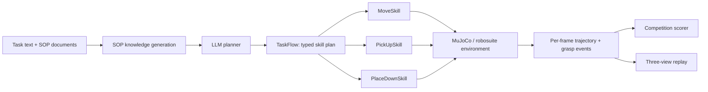

# SOP-Runner: Technical Report

## JCIIOT 2026 Industrial Embodied Intelligence Challenge

**Team:** SOP-Runner<br>
**Submission date:** 16 August 2026<br>
**Repository-scored result:** **100/100** (L1=10, L2=15, L3=20, L4=25, L5=30), with no collision deduction in the saved final scorer outputs

[Chinese report and reviewer landing page](../README.md) · [Videos](../videos/) · [Trajectory evidence](../trajectories/) · [Compact implementation](../code/)

## Abstract

SOP-Runner is an auditable mobile-manipulation system for five FactorySorting tasks performed by a dual-arm Tiago robot in MuJoCo/robosuite. It translates a natural-language SOP into an explicit `move → pick_up → move → place_down` skill program, then executes the program with clearance-cost A*, a rendered-shell safety layer, a deterministic six-phase operational-space grasp servo, conservative multi-object reselection, and lever-arm-aware radial placement.

The submitted final runs score 10/10, 15/15, 20/20, 25/25 and 30/30 through the scoring path shipped with the competition repository. All seven transported objects leave their source and finish within the 0.8 m target tolerance; the saved scorer outputs contain no collision deduction. The evidence package includes the exact trajectory, scorer output, structured run result and three-view video for every level.

This report distinguishes reproducible evidence from claims: the scores are repository-generated self-evaluation results, not post-competition organizer certification; one successful final trajectory is submitted per level, not a multi-seed statistical evaluation.

## 1. Task and evaluation

Each scene asks the robot to transport one or more factory containers from a named source station to a named target station. Under the published rule, half of an object's points are awarded after it leaves the source by more than 1 m along x or y, and half after its planar distance to the target table center falls below 0.8 m. Any collision deducts five points; time breaks equal scores. L5 contains three independently scored white totes.

The solution therefore has four coupled objectives:

1. infer the correct semantic source, object and destination from the SOP;
2. navigate narrow factory corridors without contact;
3. obtain a verifiable bilateral grasp and preserve object identity;
4. release within the target region without disturbing earlier placements.

## 2. System architecture



The LLM is restricted to task decomposition. Motion generation and safety decisions are deterministic geometry/state-machine code. `TaskFlow` records every planned step, its inputs, preconditions, timeout, attempt count and outcome in `result_*.json`.

### Artifact layers

- [`code/`](../code/) is a compact reviewer-facing package containing only our skills, workflows, knowledge, parameters and model artifact.
- [`JCIIOT/`](../JCIIOT/) is the full upstream-compatible runnable project.
- [`trajectories/`](../trajectories/) contains the submitted evidence in a short, level-based layout.
- [`videos/`](../videos/) contains five composed three-view videos and fifteen individual views.

The compact and full layouts are intentional, not divergent implementations; their mapping is documented in [`code/README.md`](../code/README.md).

## 3. Method

### 3.1 SOP knowledge generation and constrained planning

`workflows/generate_sop_knowledge.py` parses the competition `.docx` files with python-docx, sends embedded images to a vision-language endpoint for descriptions, asks a text model for structured steps, and enriches the result with canonical station names and coordinates from `task_config.json` and the scene semantic maps. It emits the five `sop_gen_case_*.md` files used by the planner.

At runtime, the planner produces only registered skills. L1–L4 use four steps; L5 uses three explicit four-step cycles. The result file retains the planner's structured reasoning and each skill result for review.

### 3.2 Clearance-cost A*

Binary obstacle inflation blocks useful narrow corridors, while an uninflated shortest path hugs equipment. We retain the baseline passable-cell set but change the local edge cost:

```text
step_cost = base_step × (1 + w × tight_penalty(clearance))
w = 6.0; tight_clearance = 0.30 m
```

`tight_penalty` rises smoothly as the Euclidean distance transform approaches an obstacle. Diagonal motion is rejected when either orthogonal neighbor is blocked, preventing corner cutting. If enhanced A* finds no route, the caller explicitly falls back to the baseline planner, so the enhancement does not silently remove baseline reachability.

This builds on the classical A* search formulation of [Hart, Nilsson and Raphael (1968)](https://doi.org/10.1109/TSSC.1968.300136); our contribution is the competition-specific clearance cost and its integration with rendered-shell constraints.

### 3.3 Rendered-shell safety layer

Several factory machines have rendered meshes that extend beyond their smaller physical collision proxies. A path can consequently be collision-free for the judge while the visible robot appears to intersect a machine in video.

`_visual_shell_grid` projects actual rendered surface triangles through the robot body height band into a 2.5 cm danger grid. Convex hulls are deliberately avoided because they would fill legitimate openings in racks. The same layer is used by route planning and close-range stance guards, aligning scored safety and visual evidence.

### 3.4 Six-phase dual-arm grasp servo

An early behavior-cloning controller was sensitive to a train/inference image-domain mismatch. The final scored controller instead uses a deterministic low-dimensional operational-space waypoint servo:

1. lift both end effectors to a clearance height;
2. approach the target in XY;
3. descend;
4. settle both end-effector centers around the selected wall;
5. close both grippers;
6. hold and verify lift success.

The control idea follows the operational-space formulation introduced by [Khatib (1987)](https://doi.org/10.1109/JRA.1987.1087068). The submitted BC checkpoint is retained for provenance and ablation; it is not the final action generator.

### 3.5 Reachability-aware wall selection and stance correction

Nominal sites are not uniformly reachable by both arms. The controller uses station topology:

- aisle-facing containers retain their nominal grasp sites;
- regular input-line totes use the `+x` wall (`inset=0.30 m`, `span=±0.12 m`);
- the northern auxiliary-input tote uses the `−y` wall, with the base centered along the wall normal.

Before grasping, the base moves toward an object-relative stance using generalized-coordinate increments of at most 0.02 m. Each increment is followed by a simulation step and a trajectory record. A trial pose is reverted and backed away if it contacts a scene proxy, another movable object, or a rendered shell.

This must be described precisely: close-range stance correction is bounded incremental kinematic qpos motion with simulation stepping and contact checks, not a wheel-ground dynamics controller. It does not perform a single-step jump across a route.

### 3.6 World-consistent sandbox grasping

Grasp control runs in a fresh evaluation environment with the same scene configuration. A naive all-object synchronization would reset objects already transported in the navigation environment. Our minimal protocol synchronizes only the currently grasped object's state, then moves the navigation base incrementally to the sandbox base's world pose. Mobile-base coordinates are spawn-relative, so raw base qpos copying is intentionally avoided.

During sandbox recording, non-grasped objects are written from their real navigation-environment state. This prevents a recording artifact in which earlier objects appear to jump back to their spawn positions.

### 3.7 Conservative multi-object reselection

The L5 planner can repeat a stale object name. Before each grasp, `PickUpSkill` reads the requested object's live position. It substitutes another object only if the requested object is provably more than 1.5 m from the pick station and a same-family candidate remains near the station. The rule is therefore state-gated and family-constrained rather than a blind index rotation.

### 3.8 Lever-arm alignment and radial placement

A carried object's base-frame offset is `rel=(rel_x, rel_y)`. Facing the base toward the target is insufficient when `rel_y ≠ 0`. We define

```text
phi   = atan2(rel_y, rel_x)
psi   = atan2(target_y - base_y, target_x - base_x)
yaw_v = psi - phi
```

and create a virtual facing station on `yaw_v`, rotating the carry lever onto the base-to-target ray. For crowded L5 placement, candidate slots are ranked using live object positions and swing clearance. The robot turns outside the table, then approaches the selected slot radially. A trend-aware guard aborts before a new closest approach violates the configured separation and tries the next candidate.

The environment-provided `transport_attachment` continuously synchronizes the carried object during transport and lowering. We retain that mechanism rather than presenting the behavior as pure contact-dynamics holding. At placement, the object is interpolated down to a table-aware release height, the attachment is cleared, the grippers open, and gravity settles the object.

## 4. Results and analysis

### 4.1 Final submitted runs

| Level | Task | Frames | Successful grasp events | Target error | Wall time | Evidence | Score |
|---|---|---:|---:|---:|---:|---|---:|
| L1 | container, `input_5 → output_4` | 2,051 | 1 | **0.17 m** | 219.762 s | [score JSON](../trajectories/L1/score_20260816_111213_OK.json) | **10/10** |
| L2 | green tote, `input_6 → output_4` | 1,800 | 1 | **0.14 m** | 212.008 s | [score JSON](../trajectories/L2/score_20260816_111600_OK.json) | **15/15** |
| L3 | blue tote, `aux_input_1 → output_5` | 1,969 | 1 | **0.11 m** | 226.280 s | [score JSON](../trajectories/L3/score_20260816_111938_OK.json) | **20/20** |
| L4 | container, `input_2 → output_5` | 2,734 | 1 | **0.12 m** | 333.210 s | [score JSON](../trajectories/L4/score_20260816_112331_OK.json) | **25/25** |
| L5 | three white totes, `input_1 → aux_output_1` | 6,060 | 3 | **0.09 / 0.56 / 0.55 m** | 815.948 s | [score JSON](../trajectories/L5/score_20260816_112911_OK.json) | **30/30** |
| **Total** | seven objects | **14,614** | **7** | all `< 0.8 m` | — | [evidence index](../trajectories/README.md) | **100/100** |

The scorer labels confirm that every object left its source and reached its target after a successful grasp. The final score files contain no collision deduction. L5 records three separate `grasp_start/grasp_end(success=true)` pairs for `left_center`, `left_back` and `left_front`.

### 4.2 Qualitative evidence

Each level has a composed 1280×720 H.264/MP4 video with bird's-eye, robot-view and follow cameras, plus the three source camera files. The README preview images are extracted from the real videos. All twenty files passed first/middle/last-frame decoding checks.

[Open the video center](../videos/README.md)

### 4.3 What the results demonstrate

- one shared skill architecture handles containers, ordinary totes, an auxiliary-input tote and a three-object destination;
- all target errors have at least 0.24 m margin to the 0.8 m threshold, except no object is close to the boundary by more than the L5 0.56/0.55 m placements;
- L5 preserves three object identities and avoids overwriting earlier placements;
- scored collision avoidance and rendered-shell avoidance are treated as separate constraints.

## 5. Innovation statement: failure evidence as a control-design input

Our innovation claim is scoped to **algorithmic and systems advances over the competition baseline**, not to inventing A*, operational-space control, or behavior cloning. The central contribution is a falsifiable engineering loop: reviewer-found counterexamples are localized to exact frames and objects, measured separately in physical, rendered-geometry, and media layers, corrected in the controller, and accepted only after five-level reruns and independent audits.

| Innovation | Baseline failure mode | Technical contribution | Measured final evidence |
|---|---|---|---|
| Clearance-cost A* | Binary inflation closes narrow aisles; an unpenalized shortest path hugs equipment | Continuous distance-field cost without removing baseline-passable cells, plus no diagonal corner cutting | All five routes complete; zero `has_judge_collision=true` frames in 14,614 final frames |
| Dual-layer rendered-shell safety | Physical proxies are smaller than some visible machine shells | A 2.5 cm grid from actual rendered triangles, dilated by 0.29 m for A*, with a 0.25 m incremental-drive guard | Guard-only ablation scored 75/100; planning plus guard restored 100/100 and eliminated final visual-overlap events |
| Station-topology grasping | One nominal grasp face is not bilaterally reachable at every station | `+x/-y` wall selection, wall-normal stance, and deterministic six-phase OSC servo | Seven successful `grasp_end` events across containers, regular totes, and an auxiliary-input tote |
| Minimal world-consistent sandbox synchronization | Synchronizing all sandbox objects rolls previously moved objects back to spawn | Reconcile only the active object and the base world pose; record all other objects from the navigation environment | Three independent L5 object identities and three independently scored deliveries |
| Lever-aware radial placement | Facing the table does not cancel a lateral carry offset; turning beside a crowded table sweeps already placed objects | Closed-form `yaw_v = psi - phi`, outside-table turning, radial approach, live slot ranking, and a trend-aware swing guard | L5 errors of 0.09/0.56/0.55 m with no repeated-object placement or neighbour displacement |
| State-gated identity recovery | A repeated planner name can refer to an object already transported | Substitute only when the requested object is over 1.5 m from the source and a same-family candidate remains within 1.5 m | Three distinct successful L5 grasp events rather than blind index rotation |

### 5.1 What failed, and how it changed the design

The original screenshots are retained in the [historical error-evidence index](assets/iteration/README.md). They exposed defects that the scalar score alone did not reveal:

| Historical counterexample | Quantitative diagnosis | Corrective mechanism | Final closure |
|---|---|---|---|
| L2/L3/L4 neighbouring objects were knocked from their stations | L2 fell 2.29 m and was pushed about 2.3 m; L3 fell 1.79 m | Reapply the lifted pose, raise by 0.35 m, retreat 0.8 m away from the table, and guard both base-drive paths against movable-object contact | Maximum planar displacement of every never-grasped object in the five final trajectories is 0.000 m |
| L5's second placement swept through the first tote | Historical penetration −36 mm, 0.637 m displacement, final centre distance 0.295 m below the 0.40 m tote width | Dynamic `0/±0.55 m` slots, turn at an exterior standoff, approach radially, and abort a newly closing swing below 0.40 m | Three independent target deliveries at 0.09/0.56/0.55 m |
| The judge collision audit reported zero while the robot visibly intersected equipment | Triangle-level reconstruction found true 32–76 mm torso-shell intersections; the earlier convex-hull model also over-filled hollow racks | Rasterize actual surface triangles rather than convex hulls, then share the surface model between A* and close-range driving | Final five-level visual audit reports zero body-shell events and zero guard-replay triggers |
| Follow-camera video contained structured colour noise and frozen segments | The old all-frames list could approach 3 GB per L5 view and leave a corrupted OSMesa readback context | 120-frame streaming chunks, local-luminance corruption threshold 12, motion-conditioned freeze detection, and retry in a fresh renderer context | All 15 source views passed corruption/black/freeze checks; all five composed demonstrations are available in the repository |

The final closure claim is intentionally precise: every failure family represented by the 15 saved screenshots was localized, corrected, and did not recur in the five submitted 16 August runs. It is not a claim of universal robustness to unseen factories or arbitrary random seeds.

## 6. Compliance and implementation disclosure

The final implementation intentionally discloses the following details:

- there is no code that clears `has_judge_collision`; the flag is read for recording/termination only;
- there is no one-step base jump over a navigation route; close-range correction uses bounded qpos increments with simulation steps, while route navigation uses the environment path follower;
- carrying and lowering use the competition environment's `transport_attachment`, which synchronizes object qpos continuously; sandbox reconciliation also writes the active object's state;
- the final BC checkpoint is not used to generate the submitted grasp actions;
- `_factory_physics_patch.py` installs the enhanced grasp/place/record routines at import time using runtime function rebinding. This preserves on-disk competition harness files but introduces indirection, so both the patch and every importing skill are included for audit;
- scores are self-evaluation outputs produced with the repository's competition scoring code.

Historical development notes contain rejected teleport/direct-place experiments. Those entries are retained for transparency and explicitly marked as superseded; they are not the final submitted implementation.

## 7. Third-party components and prior work

| Component | Submitted environment version | Role |
|---|---:|---|
| [MuJoCo](https://mujoco.org/) | 3.9.0 | physics simulation |
| [robosuite](https://robosuite.ai/) | vendored project copy | robot/environment abstraction |
| [robomimic](https://robomimic.github.io/) | vendored project copy | BC training/checkpoint framework |
| PyTorch | 2.7.0 | model artifact loading/training |
| NumPy | 1.26.4 | geometry and state operations |
| SciPy | 1.15.3 | Euclidean distance transform |
| python-docx | 1.2.0 | SOP document parsing |
| OpenCV | 4.8.1.78 | image processing |
| ImageIO / imageio-ffmpeg | 2.37.3 / 0.6.0 | video generation |

The exact environment is pinned in [`JCIIOT/requirements.txt`](../JCIIOT/requirements.txt). Source and scene assets originate from the [official JCIIOT2026 repository](https://github.com/JCIIOT2026/JCIIOT2026). Each upstream component remains subject to its own license and the competition's asset terms.

## 8. Reproducibility

### 8.1 Installation

```bash
git clone https://github.com/yangwinnietang/JCIIOT2026-tang.git
cd JCIIOT2026-tang
git lfs pull

cd JCIIOT
python3.11 -m venv .venv
source .venv/bin/activate
pip install -r requirements.txt
pip install -e .
```

Headless Linux rendering:

```bash
sudo apt-get install -y libosmesa6-dev xvfb
Xvfb :99 -screen 0 1920x1080x24 &
export DISPLAY=:99
export MUJOCO_GL=osmesa
export GATE_OLLAMA=true
export PYTHONPATH="src:robosuite/robosuite:robomimic:."
```

Configure the same public OpenAI-compatible endpoint used by the final planner without committing a secret:

```bash
export OPENAI_API_KEY="<your-compatible-api-key>"
export OPENAI_BASE_URL="https://open.bigmodel.cn/api/paas/v4"
export OPENAI_MODEL="glm-5.2"
```

### 8.2 Run and score

The interactive competition entry point is:

```bash
streamlit run app.py
```

For one headless level (`task-index` 0–4 maps to L1–L5):

```bash
TS=$(date +%Y%m%d_%H%M%S)
python -m robot_agent.task_subprocess_runner \
  --task "<task text>" --task-index <0-4> --timestamp "$TS" \
  --result-json "recordings/<env_name>/result_${TS}.json" --app-dir .

python score_dev.py "recordings/<env_name>/trajectory_${TS}_OK.json" \
  --task-index <0-4> --save
```

The submitted trajectories can be reviewed without the simulation runtime in [`trajectories/`](../trajectories/). A strict rerun still requires the competition scene assets and a compatible live LLM endpoint.

### 8.3 Reviewer audit path

Recommended review order:

1. check the exact scores in [`trajectories/README.md`](../trajectories/README.md);
2. watch the five composed videos in [`videos/`](../videos/);
3. inspect the compact code using [`code/README.md`](../code/README.md);
4. compare the compact code with the installed files under `JCIIOT/`;
5. run Python compilation and, in a configured simulation environment, the included trajectory/contact/visual audit tools.

## 9. Limitations

- One final successful trajectory per level is submitted; there is no multi-seed success-rate estimate or confidence interval.
- L5 takes approximately 13.6 minutes wall time. The controller prioritizes clearance and deterministic state transitions over speed.
- Geometry-specific wall and station priors limit zero-shot generalization to unseen object sizes and table orientations.
- A live external LLM service is required to regenerate the same planning path; provider-side model updates may affect byte-identical reproduction.
- Runtime rebinding keeps allowed modifications localized but makes the execution path less direct than static backend integration.
- The BC checkpoint demonstrates the explored learning path but not the final action policy; future work should close the visual-domain gap and report a controlled learned-versus-scripted ablation.

## 10. Submission index

- Chinese primary report: [`README.md`](../README.md)
- Compact implementation: [`code/`](../code/)
- Full runnable project: [`JCIIOT/`](../JCIIOT/)
- Final trajectories and score files: [`trajectories/`](../trajectories/)
- Five composed + fifteen individual videos: [`videos/`](../videos/)
- Full Chinese development log: [`DEVELOPMENT_LOG_ZH.md`](DEVELOPMENT_LOG_ZH.md)
- Submission manifest: [`MANIFEST.md`](../MANIFEST.md)
